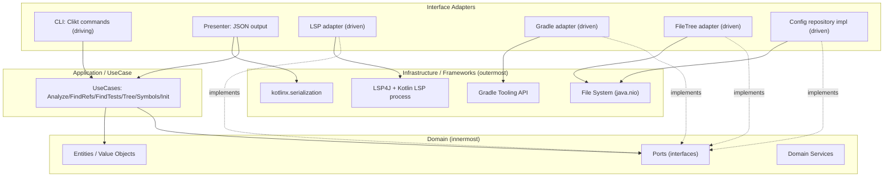

# 01. Architecture (Clean Architecture)

> Translation: [日本語](../ja/01-architecture.md) ／ [Back to index](../README.md)

## 1. Approach

`kode` adopts **Clean Architecture**. A tech-agnostic **domain** sits at the center, and all external technologies — LSP, Gradle, file system, JSON serializer — are placed on the outside. **Dependencies always point inward** (outer → inner); the domain knows nothing about external tech.

This yields:

- Easy substitution/mocking of LSP and Gradle (testability).
- The domain is unaffected even though the Kotlin LSP is Alpha / partially closed ([04](04-lsp.md)).
- native-image-specific constraints (avoiding reflection, etc.) stay confined to the outer layers ([08](08-native-image.md)).

## 2. Layers



The **Dependency Rule**: arrows (dependencies) always point from outer to inner. The dotted `implements` arrows mean an outer adapter implements a **port** defined inside (the domain) — i.e., Dependency Inversion (DIP).

## 3. Responsibilities per Layer

### Domain (innermost)
- Framework-agnostic; depends only on the Kotlin standard library.
- Holds **entities**, **value objects**, **domain services**, and **ports (interfaces)**.
- Models `kode`'s responsibility boundary — "no semantic interpretation; only structure the data."
- See [02. Domain Model](02-domain-model.md).

### Application / UseCase
- One use case per command:
  - `AnalyzeErrorsUseCase` (`kode errors`)
  - `FindReferencesUseCase` (`kode refs`)
  - `FindTestsUseCase` (`kode test`)
  - `BuildTreeUseCase` (`kode tree`)
  - `ListSymbolsUseCase` (`kode symbols`)
  - `InitProjectUseCase` (`kode init`)
- Calls external resources through ports, assembles domain objects, and returns a result DTO.

### Interface Adapters
- **Driving**: Clikt CLI commands. Parse input and call use cases. A `Presenter` converts use case results into JSON strings and routes them to stdout/stderr ([07](07-error-handling.md)).
- **Driven**: Port implementations. An anti-corruption layer (ACL) that maps external-tech responses to domain objects.

### Infrastructure / Frameworks
- Concrete tech: LSP4J + Kotlin LSP process, Gradle Tooling API, `java.nio` file system, kotlinx.serialization.

## 4. Composition Root and Pure DI

We **do not use** a DI framework (Koin/Spring, etc.). Reasons: avoid reflection/dynamic proxies under native-image ([08](08-native-image.md)), and make the Clean Architecture wiring explicit.

`bootstrap/Main.kt` is the **single Composition Root**, where all implementations are wired manually.

```kotlin
// pseudo-code: bootstrap/Main.kt
fun main(args: Array<String>) {
    // --- Create Infrastructure / Adapters (outer) ---
    val configRepo: ProjectConfigRepository = JsonProjectConfigRepository(fs = NioFileSystem)
    val lspFactory: LspSessionFactory = Lsp4jSessionFactory(resolver = KotlinLspResolver())
    val gradle: BuildModelPort = GradleToolingAdapter()
    val fileTree: FileTreePort = NioFileTreeAdapter()

    // --- Inject port impls into UseCases (inner) ---
    val errors  = AnalyzeErrorsUseCase(configRepo, lspFactory)
    val refs    = FindReferencesUseCase(configRepo, lspFactory)
    val tests   = FindTestsUseCase(configRepo, gradle)
    val tree    = BuildTreeUseCase(configRepo, fileTree)
    val symbols = ListSymbolsUseCase(configRepo, lspFactory)
    val init    = InitProjectUseCase(gradle, configRepo)

    // --- Build the CLI (driving adapter) and run ---
    KodeCli(errors, refs, tests, tree, symbols, init).main(args)
}
```

Key point: the inner layer (UseCase) depends only on interfaces (ports); concrete implementations are instantiated and injected from the outside.

## 5. Module / Package Boundaries

| Package | Layer | May depend on |
|---------|-------|---------------|
| `domain` | Domain | (nothing; Kotlin stdlib only) |
| `application` | UseCase | `domain` |
| `adapter.cli` / `adapter.presenter` | Interface Adapter (driving) | `application`, `domain` |
| `adapter.lsp` / `.gradle` / `.fs` / `.config` | Interface Adapter (driven) | `domain` (port impls), respective infra |
| `bootstrap` | Composition Root | everything |

It is recommended to verify this rule mechanically with ArchUnit, etc. ([10](10-directory-layout.md)).

## 6. Related Chapters

- Domain internals → [02. Domain Model](02-domain-model.md)
- Per-command flows → [03. Command Flows](03-commands.md)
- Port implementations → [04. LSP](04-lsp.md) / [05. Gradle](05-gradle-tooling.md) / [06. Config](06-config-kode-json.md)
