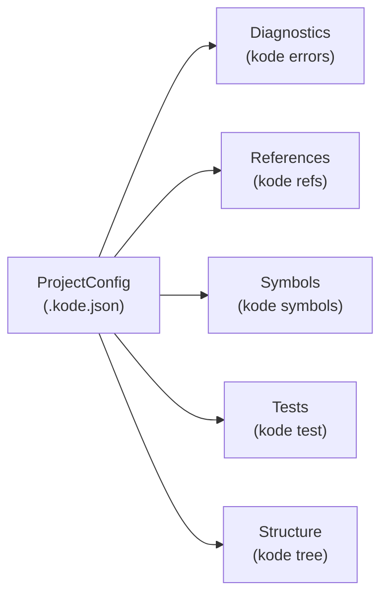

# 02. Domain Model (DDD)

> Translation: [日本語](../ja/02-domain-model.md) ／ [Back to index](../README.md)

## 1. Ubiquitous Language

| Term | Meaning |
|------|---------|
| Project | A Kotlin project recognized via `.kode.json`. The aggregate root. |
| Diagnostic | An error/warning returned by the LSP (position, severity, message, snippet). |
| Reference | A location in source that references a given symbol. |
| Symbol | A named code element such as a class, function, or property. |
| TestClass | A test class related to a target, plus its test functions. |
| FileTreeNode | A directory/file in the file tree. |

`kode`'s vocabulary stops at **collection and structuring**. It has **no vocabulary for judgement** like "this fix is correct" or "this test should be added" (that's the AI's responsibility).

## 2. Bounded Contexts

Each command roughly maps to one context. Coupling between contexts is weak; the only thing shared is the `ProjectConfig` context.



## 3. Value Objects

Immutable; equality is by value.

```kotlin
// pseudo-code: domain/valueobject
@JvmInline value class FilePath(val value: String)        // relative to project root
data class SourcePosition(val line: Int, val column: Int)  // 1-based
@JvmInline value class CodeSnippet(val text: String)
@JvmInline value class SymbolName(val value: String)       // "FooClass" / "FooClass.doSomething"
enum class Severity { ERROR, WARNING, INFORMATION, HINT }
@JvmInline value class KotlinVersion(val value: String)    // "2.1.0"
```

Invariants (examples): `SourcePosition.line >= 1`; `FilePath` never holds an absolute path (output is always root-relative).

## 4. Entities & Aggregates

### Aggregate root: `KotlinProject`
```kotlin
// pseudo-code: domain/entity
class KotlinProject(
    val root: ProjectRoot,            // absolute path (lives only inside the boundary)
    val buildTool: BuildTool,         // GRADLE (MAVEN in the future)
    val kotlinVersion: KotlinVersion,
    val sourceDirs: List<FilePath>,
    val testDirs: List<FilePath>,
)
```
Generating/loading `.kode.json` centers on this aggregate ([06](06-config-kode-json.md)).

### Other entities / result objects
```kotlin
data class Diagnostic(
    val position: SourcePosition,
    val severity: Severity,
    val message: String,
    val snippet: CodeSnippet,
)
data class Reference(val file: FilePath, val position: SourcePosition, val snippet: CodeSnippet)
data class Symbol(           // documentSymbol normalized into kode's vocabulary
    val kind: SymbolKind,    // CLASS / FUNCTION / PROPERTY ...
    val name: SymbolName,
    val detail: SymbolDetail // kind-dependent detail: fields/arguments/return type
)
data class TestClass(val name: SymbolName, val file: FilePath, val functions: List<SymbolName>)
sealed interface FileTreeNode {
    data class Directory(val name: String, val children: List<FileTreeNode>) : FileTreeNode
    data class File(val name: String) : FileTreeNode
}
```

## 5. Ports (domain-side interfaces)

All external tech is hidden behind **ports**. Ports take/return **domain vocabulary** (no leaking of LSP or Gradle types). Their implementations live in the Interface Adapter layer ([01](01-architecture.md)).

```kotlin
// pseudo-code: domain/port
interface DiagnosticsPort { fun diagnostics(file: FilePath): List<Diagnostic> }       // LSP impl
interface ReferencePort  { fun references(target: SymbolName): List<Reference> }       // LSP impl
interface SymbolPort     { fun symbols(file: FilePath): List<Symbol> }                 // LSP impl
interface TestDiscoveryPort { fun testsFor(target: SymbolName): List<TestClass> }      // Gradle impl
interface BuildModelPort { fun introspect(root: ProjectRoot): KotlinProject }          // Gradle impl
interface FileTreePort   { fun walk(roots: List<FilePath>): FileTreeNode.Directory }   // FS impl
interface ProjectConfigRepository {                                                    // .kode.json impl
    fun load(start: ProjectRoot): KotlinProject?
    fun save(project: KotlinProject)
}
```

| Port | Impl layer | Chapter |
|------|-----------|---------|
| `DiagnosticsPort` / `ReferencePort` / `SymbolPort` | `adapter.lsp` | [04](04-lsp.md) |
| `TestDiscoveryPort` / `BuildModelPort` | `adapter.gradle` | [05](05-gradle-tooling.md) |
| `FileTreePort` | `adapter.fs` | — |
| `ProjectConfigRepository` | `adapter.config` | [06](06-config-kode-json.md) |

## 6. Domain Services

Logic that doesn't belong to a single entity goes into domain services. Examples:

- `SnippetExtractor`: pure logic that cuts out a surrounding source snippet from a position (receives text via a port, no I/O of its own).
- `SymbolMatcher`: interpreting `SymbolName` (`Foo` / `Foo.bar`) and the rules for identifying test/reference targets.

These are side-effect-free and easy to unit-test ([10](10-directory-layout.md)).

## 7. Immutability and Error Representation

- The domain may throw exceptions, but at the **process boundary they are always converted to JSON** ([07](07-error-handling.md)).
- An "empty result" (zero references, zero diagnostics, etc.) is the **happy path**. Return an empty array; do not treat it as an error.
