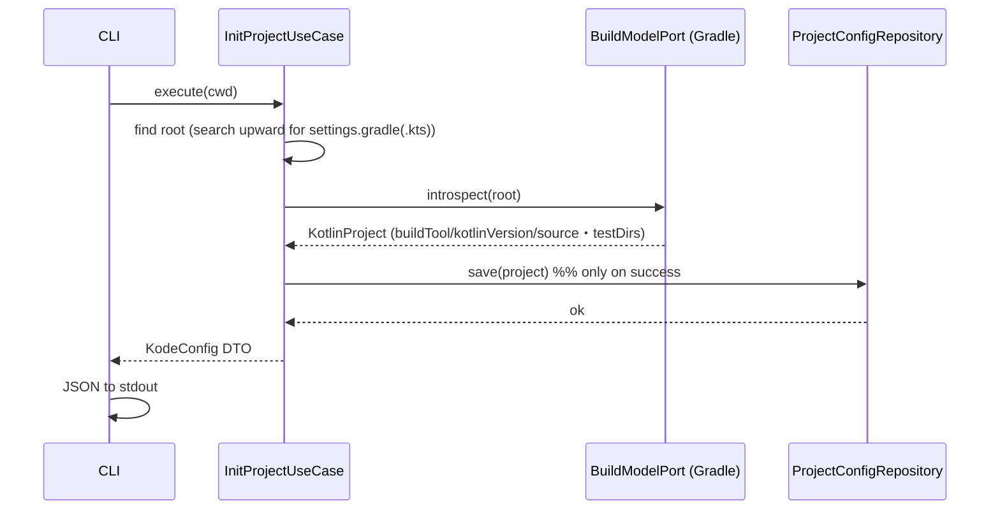
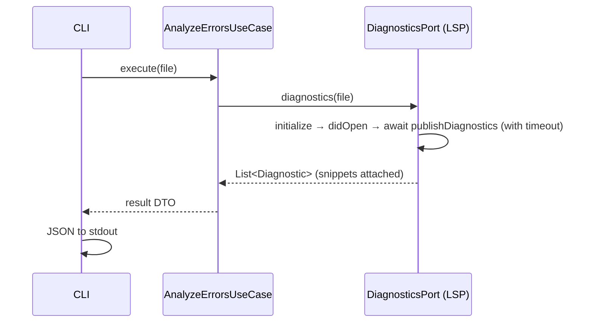
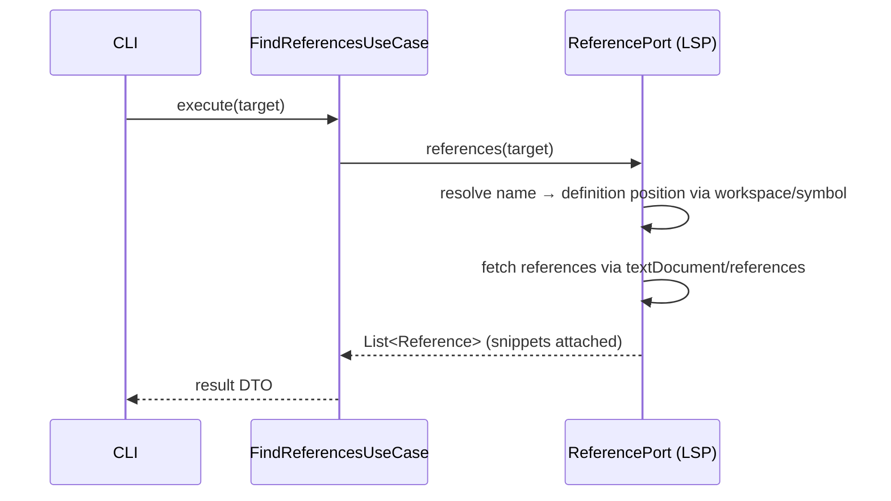
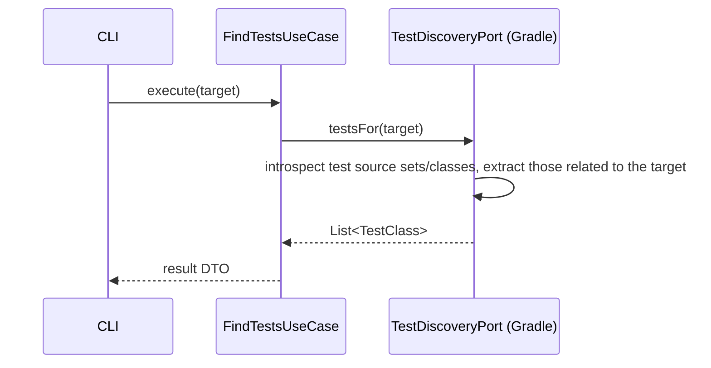
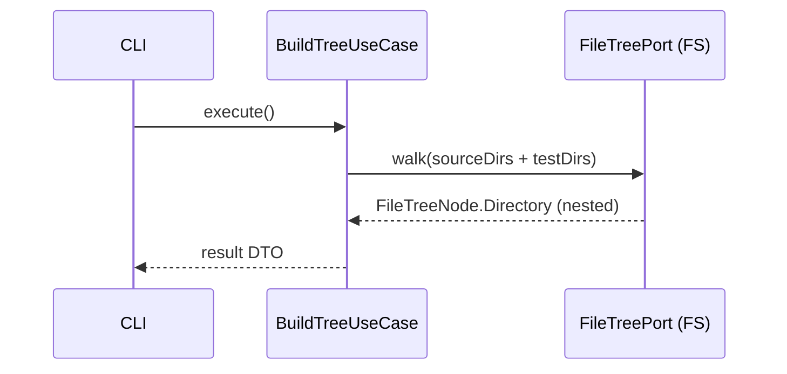
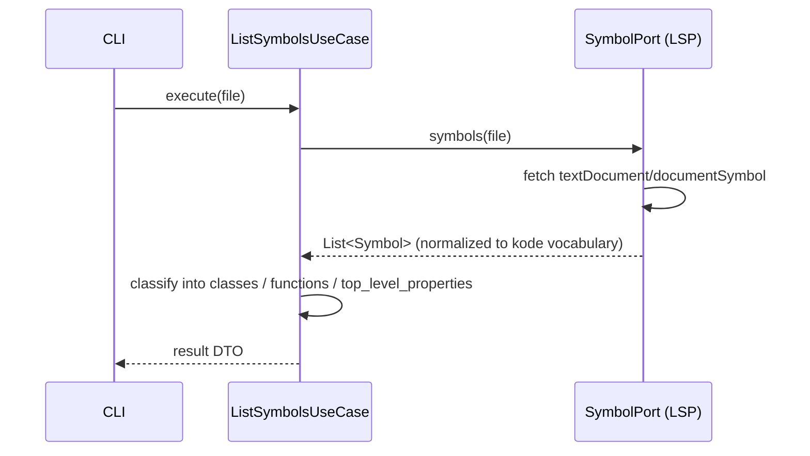

# 03. Command Flows

> Translation: [日本語](../ja/03-commands.md) ／ [Back to index](../README.md)

Every command shares the structure "Clikt command (driving adapter) → UseCase → Port → Presenter (JSON)" ([01](01-architecture.md)). Output JSON schemas follow the samples in the requirements.

Common preprocessing: every command except `init` first resolves `.kode.json` via `ProjectConfigRepository.load()`. If not found, it returns an error JSON with exit code 2 ([07](07-error-handling.md)).

---

## `kode init`

Recognize the project and generate `.kode.json`. **On error, generate nothing.**



```kotlin
// pseudo-code
fun InitProjectUseCase.execute(cwd: ProjectRoot): KodeConfig {
    val root = findProjectRoot(cwd) ?: throw NoProjectRootException()
    val project = gradle.introspect(root)   // on failure: throw → abort here (do not save)
    configRepo.save(project)                // write only on success (atomic, ch. 06)
    return project.toConfigDto()
}
```

Output:
```json
{
  "version": "1.0",
  "project": {
    "root": "/path/to/project",
    "build_tool": "gradle",
    "kotlin_version": "2.1.0",
    "source_dirs": ["src/main/kotlin"],
    "test_dirs": ["src/test/kotlin"]
  }
}
```

---

## `kode errors <file>`

Return errors/warnings and surrounding snippets via the LSP. Diagnostics are **push notifications**, so we wait after `didOpen` ([04](04-lsp.md)).



Output:
```json
{
  "file": "src/main/kotlin/Foo.kt",
  "diagnostics": [
    {
      "line": 42,
      "column": 10,
      "severity": "error",
      "message": "Type mismatch: expected String, found Int",
      "snippet": "val x: String = 42"
    }
  ]
}
```

---

## `kode refs <class/function>`

Return references to the given class/function via the LSP. LSP `references` requires a **position**, so the name is resolved to a position via `workspace/symbol` first — a two-step approach ([04](04-lsp.md)).



Output:
```json
{
  "target": "FooClass",
  "refs": [
    { "file": "src/main/kotlin/Bar.kt", "line": 10, "column": 5, "snippet": "val foo = FooClass()" }
  ]
}
```

---

## `kode test <class/function>`

Return related test classes/functions via the Gradle Tooling API ([05](05-gradle-tooling.md)).



Output:
```json
{
  "target": "FooClass",
  "tests": [
    {
      "class": "FooClassTest",
      "file": "src/test/kotlin/FooClassTest.kt",
      "functions": ["testSomething", "testAnotherThing"]
    }
  ]
}
```

---

## `kode tree`

Return the whole-project file tree. Walk the file system starting from `source_dirs` / `test_dirs` in `.kode.json`.



Output:
```json
{
  "tree": {
    "src/main/kotlin/com/example": {
      "type": "directory",
      "children": [
        {"type": "file", "name": "Foo.kt"},
        {"type": "file", "name": "Bar.kt"},
        {"type": "directory", "name": "service", "children": [
          {"type": "file", "name": "FooService.kt"}
        ]}
      ]
    }
  }
}
```

---

## `kode symbols <file>`

Return the classes/functions/properties in a file via the LSP (`textDocument/documentSymbol`).



Output:
```json
{
  "file": "src/main/kotlin/Foo.kt",
  "classes": [
    { "name": "FooClass", "fields": [ {"name": "bar", "type": "String", "mutable": false} ] }
  ],
  "functions": [
    {
      "name": "doSomething",
      "arguments": [ {"name": "input", "type": "String"}, {"name": "count", "type": "Int"} ],
      "return_type": "Boolean"
    }
  ],
  "top_level_properties": [ {"name": "CONSTANT", "type": "String", "mutable": false} ]
}
```
