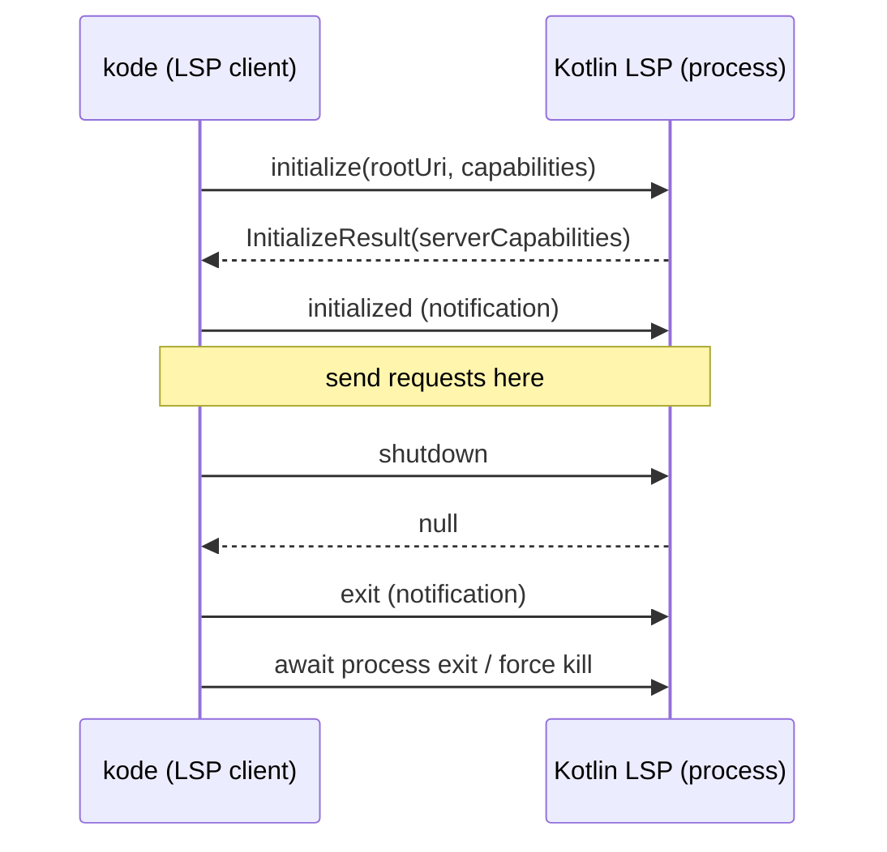

# 04. LSP Integration & Communication

> Translation: [日本語](../ja/04-lsp.md) ／ [Back to index](../README.md)

`kode errors` / `kode refs` / `kode symbols` perform code analysis via the **JetBrains official Kotlin Language Server**. This chapter describes the connection/communication and an important policy for OSS publication.

## 1. Key OSS Policy: Do Not Bundle the Kotlin LSP

The JetBrains Kotlin LSP (`Kotlin/kotlin-lsp`) is **Apache-2.0 but partially closed-source**, being based on proprietary parts of IntelliJ IDEA / Fleet / Air, and is at the **Alpha** stage ([09](09-dependencies-license.md)).

Therefore `kode` **does not bundle or redistribute** the LSP binary. It launches one the user has installed separately as an **external process**.

### Binary resolution order
1. Environment variable `KODE_LSP_PATH`
2. Optional field in `.kode.json` (e.g. `lsp.path`)
3. `kotlin-lsp` on `PATH` (installable via e.g. `brew install JetBrains/utils/kotlin-lsp`)

If not found, return a machine-readable error JSON with install guidance in `details` ([07](07-error-handling.md)).

```json
{ "error": { "code": "LSP_NOT_FOUND",
  "message": "Kotlin LSP binary not found",
  "details": "Set KODE_LSP_PATH or install via 'brew install JetBrains/utils/kotlin-lsp'" } }
```

## 2. Transport

Communicate over the child process's **stdin/stdout** using the **LSP base protocol** (JSON-RPC 2.0 with `Content-Length` headers). The implementation uses **Eclipse LSP4J**'s `LSPLauncher`, delegating framing/JSON-RPC details (we do not roll our own).

```kotlin
// pseudo-code: adapter/lsp/Lsp4jSessionFactory.kt
fun connect(root: ProjectRoot): LspSession {
    val process = ProcessBuilder(resolveLspBinary(), "--stdio")
        .directory(root.toFile())
        .redirectError(ProcessBuilder.Redirect.DISCARD) // don't mix LSP logs into stdout
        .start()
    val client = KodeLanguageClient()  // receives notifications like publishDiagnostics
    val launcher = LSPLauncher.createClientLauncher(client, process.inputStream, process.outputStream)
    val server = launcher.remoteProxy   // org.eclipse.lsp4j.services.LanguageServer
    launcher.startListening()
    return LspSession(process, server, client)
}
```

> Note: receive diagnostics/logs strictly over the LSP protocol and keep `kode`'s own **stdout dedicated to JSON results** ([07](07-error-handling.md)). The child's stderr is discarded or routed to kode's stderr.

## 3. Lifecycle



- The first version uses **one command = one short-lived session** (start → process → exit). Simple, no state management.
- **Trade-off (future)**: if startup cost is high, consider a resident daemon (a separate process holds the LSP and kode queries it over IPC). Out of scope for the first version.

## 4. Per-command LSP Details

### `kode errors`: diagnostics are push-based
LSP diagnostics arrive asynchronously via the **`textDocument/publishDiagnostics` notification**, not request/response. So:

1. Open the target file with `textDocument/didOpen`.
2. Receive notifications in `KodeLanguageClient.publishDiagnostics`.
3. Wait **with a timeout** until the target file's diagnostics stabilize (e.g. a settle time after the first notification, or an upper bound of N seconds).

```kotlin
// pseudo-code
fun diagnostics(file: FilePath): List<Diagnostic> = session.use { s ->
    val future = client.awaitDiagnostics(uriOf(file), timeout = 10.seconds)
    s.server.textDocumentService.didOpen(didOpenParams(file))
    future.get().map { it.toDomain(snippet = snippetExtractor.around(file, it.range)) }
}
```

### `kode refs`: two-step position resolution
`textDocument/references` requires a **position (line/column)**, but `kode refs` input is a **name**. So:

1. `workspace/symbol("FooClass")` to get candidate symbols and their definition positions.
2. Run `textDocument/references(includeDeclaration=false)` against the most plausible definition position.
3. Attach snippets to each reference and map to the domain.

For member references like `Foo.bar`, narrow down with `SymbolMatcher` ([02](02-domain-model.md)).

### `kode symbols`: normalizing documentSymbol
Walk the `textDocument/documentSymbol` hierarchy (`DocumentSymbol[]`) and normalize it into `kode`'s vocabulary: `classes` / `functions` / `top_level_properties`. The LSP `SymbolKind` → `kode` `SymbolKind` conversion is confined to the adapter layer.

## 5. Capability Negotiation and Assumptions

At `initialize`, declare at least these client capabilities:

- `textDocument.publishDiagnostics`
- `textDocument.references`
- `textDocument.documentSymbol` (`hierarchicalDocumentSymbolSupport`)
- `workspace.symbol`

If the server lacks a particular capability, the command requiring it returns an `LSP_CAPABILITY_UNSUPPORTED` error ([07](07-error-handling.md)).

## 6. Relationship to native-image

LSP4J uses reflection in places, so native-image may require reflection config. Generate it with `native-image-agent` and bundle it ([08](08-native-image.md)). Since the LSP itself is an external process, native-image constraints apply only to `kode`'s LSP **client**.
