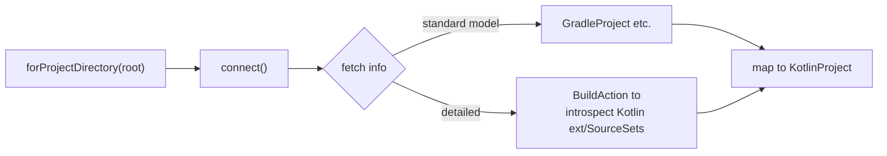
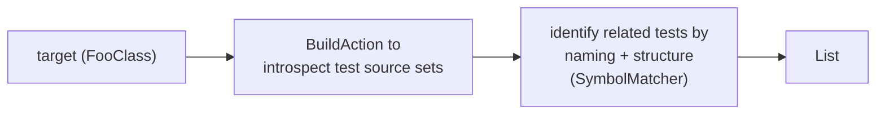

# 05. Using the Gradle Tooling API

> Translation: [日本語](../ja/05-gradle-tooling.md) ／ [Back to index](../README.md)

`kode init` (project recognition) and `kode test` (related-test discovery) use the **Gradle Tooling API**. The Tooling API is bundled into the `kode` binary; it is Apache-2.0 and poses no OSS-publication issue ([09](09-dependencies-license.md)).

## 1. Connection Basics

```kotlin
// pseudo-code: adapter/gradle/GradleToolingAdapter.kt
fun <T> withConnection(root: ProjectRoot, block: (ProjectConnection) -> T): T {
    val connector = GradleConnector.newConnector()
        .forProjectDirectory(root.toFile())
        // prefer the Wrapper (use the version from gradle/wrapper/gradle-wrapper.properties)
    val connection = connector.connect()
    return connection.use(block)   // ProjectConnection is AutoCloseable
}
```

- **Prefer the Wrapper**: follow the project's `gradlew` version to ensure compatibility. Only fall back to `useGradleVersion` when no Wrapper exists.
- **Daemon**: the Tooling API starts a Gradle Daemon. Account for the high first-run startup cost in timeout policy ([07](07-error-handling.md)).

## 2. `kode init`: Fetching the Project Model

Obtain the build tool, Kotlin version, and source/test directories. Basic info comes from standard Tooling API models (`GradleProject` / `EclipseProject` family), or from a **custom `BuildAction`** for richer info.



```kotlin
// pseudo-code
fun introspect(root: ProjectRoot): KotlinProject = withConnection(root) { c ->
    val model = c.action(KodeIntrospectionAction()).run()  // custom BuildAction
    KotlinProject(
        root = root,
        buildTool = BuildTool.GRADLE,
        kotlinVersion = KotlinVersion(model.kotlinVersion),
        sourceDirs = model.mainSourceDirs.map(::FilePath),
        testDirs = model.testSourceDirs.map(::FilePath),
    )
}
```

- `KodeIntrospectionAction` is a `BuildAction<KodeModel>` implementation. From the build's internal `Project`/`KotlinProjectExtension`/`SourceSet` it extracts the Kotlin version and source directories.
- If the Kotlin version can't be obtained, fall back to inferring it from dependency resolution or plugin info; if even that fails, **fail** `init` (no partial generation, [03](03-commands.md)).

## 3. `kode test`: Identifying Related Tests

`kode` **does not run tests** (coverage collection is out of scope). It introspects the test source sets and **statically** extracts test classes/functions related to the target symbol.



Association heuristics (domain service `SymbolMatcher`, [02](02-domain-model.md)):

- Naming: `FooClass` ↔ `FooClassTest` / `FooClassTests` / `FooClassSpec`.
- Same package / under the corresponding test directory.
- Test function lists are extracted from the class structure in test sources (functions with test annotations).

> Note: for more precise reference-based association you could combine with LSP `refs` ([04](04-lsp.md)), but the first version uses naming/structure.

## 4. Resource Management and Errors

- Always close `ProjectConnection` with `use { }` (try-with-resources equivalent).
- Catch `BuildException` / connection failure / timeout in the adapter layer and convert to a `GRADLE_FAILURE` (exit 4) domain exception ([07](07-error-handling.md)).
- Do not mix Gradle's stdout/logs into `kode`'s stdout (route `setStandardOutput`/`setStandardError` to stderr).

## 5. Compatibility with native-image

The Gradle Tooling API internally does class loading and Daemon process startup, so native-image compatibility needs care ([08](08-native-image.md)).

- Generate and bundle the required reflection/resource config with `native-image-agent`.
- **Fallback** if it can't be stabilized under native-image: instead of the Tooling API, launch the external `./gradlew` as a subprocess and obtain the result (a model JSON) from a task injected via `--init-script`. Keep this escape hatch in the design.
