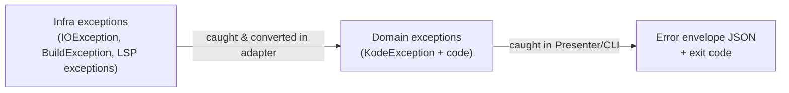

# 07. Error Handling Policy

> Translation: [日本語](../ja/07-error-handling.md) ／ [Back to index](../README.md)

`kode`'s consumer is an AI agent. Therefore errors must also be **machine-readable**. Success and failure are handled by a consistent convention.

## 1. Output Convention

| Result | Destination | Format | exit code |
|--------|-------------|--------|-----------|
| Success | **stdout** | The command's schema JSON ([03](03-commands.md)) | 0 |
| Failure | **stderr** | Error envelope JSON | non-zero |

- **stdout is dedicated to JSON results.** Never mix in logs, progress, or LSP/Gradle output (contamination breaks the AI's JSON parsing). Diagnostic logs go to stderr.
- On failure, write nothing (or empty) to stdout. The AI judges via the exit code and the stderr JSON.

### Error envelope
```json
{
  "error": {
    "code": "LSP_NOT_FOUND",
    "message": "Kotlin LSP binary not found",
    "details": "Set KODE_LSP_PATH or install via 'brew install JetBrains/utils/kotlin-lsp'"
  }
}
```

- `code`: a stable, machine-readable identifier (table below). The AI can branch on it.
- `message`: a short human/AI-oriented description.
- `details`: optional. Recovery steps / extra context.

## 2. Exit Codes and Error Codes

| exit | Category | Representative `code` | Meaning |
|------|----------|------------------------|---------|
| 0 | Success | — | Normal (zero results is still success) |
| 1 | General error | `INTERNAL_ERROR`, `INVALID_ARGUMENT` | Unexpected / bad arguments |
| 2 | No/invalid config | `NO_PROJECT_CONFIG`, `INVALID_CONFIG`, `NO_PROJECT_ROOT` | `.kode.json` missing/corrupt, root not found |
| 3 | LSP failure | `LSP_NOT_FOUND`, `LSP_TIMEOUT`, `LSP_CAPABILITY_UNSUPPORTED`, `LSP_CRASHED` | LSP-related ([04](04-lsp.md)) |
| 4 | Gradle failure | `GRADLE_FAILURE`, `GRADLE_TIMEOUT` | Tooling API-related ([05](05-gradle-tooling.md)) |

> Two tiers: exit code is the category, `code` is the detail. The AI can branch coarsely on exit code and respond precisely on `code`.

## 3. "Empty" Is Success, Not an Error

Zero references / zero diagnostics / zero tests are the **happy path**. Return an empty array (e.g. `refs: []`) with exit 0. "Not found" is not an error ([02](02-domain-model.md) §7).

## 4. Special Rule for `kode init`

On failure, `init` **generates no `.kode.json` at all**. A failure at the `introspect` (Gradle) stage aborts before `save` and does not modify the file system ([06](06-config-kode-json.md)). This prevents a half-written config from being left behind.

## 5. Timeouts and External-Process Anomalies

- **LSP**: set upper bounds on waiting for diagnostics after `didOpen` and on `references`/`documentSymbol` responses → `LSP_TIMEOUT`. If the process crashes/exits abnormally → `LSP_CRASHED`. In all cases, reliably terminate (kill) the process before returning the error.
- **Gradle**: set a generous timeout that includes Daemon startup → `GRADLE_TIMEOUT`. `BuildException` → `GRADLE_FAILURE`.
- In all cases, guarantee `destroy()` / `connection.close()` in `finally` to prevent child-process leaks.

## 6. Exception Translation in Clean Architecture

Exceptions are handled per layer ([01](01-architecture.md)).



- **Adapter layer**: convert external-tech exceptions into subtypes of `KodeException` with a stable `code` (anti-corruption).
- **CLI/Presenter layer**: catch `KodeException` at the top level, write the envelope JSON to stderr, and exit with the corresponding code. Uncaught exceptions are rounded to `INTERNAL_ERROR` (exit 1) (only a summary of the stack trace in stderr details; no sensitive data).

```kotlin
// pseudo-code: top-level handling in bootstrap
fun runCli(args: Array<String>): Int = try {
    KodeCli(...).parse(args)   // on success, result JSON to stdout
    0
} catch (e: KodeException) {
    System.err.println(json.encodeToString(e.toEnvelope()))
    e.exitCode
} catch (e: Throwable) {
    System.err.println(json.encodeToString(internalErrorEnvelope(e)))
    1
}
```

## 7. Logging Policy

- By default `kode` emits no logs of its own (avoid noise for the AI).
- Only when `--verbose` (or similar) is set, emit diagnostic logs to **stderr**. The stdout JSON contract is always invariant.
