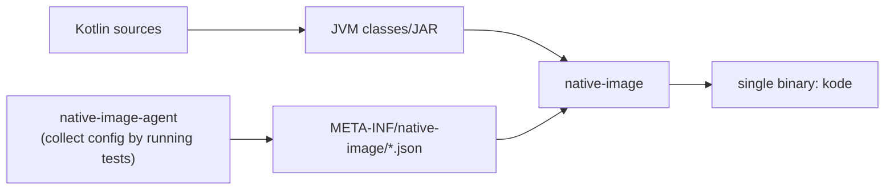

# 08. GraalVM Native Image Build Policy

> Translation: [日本語](../ja/08-native-image.md) ／ [Back to index](../README.md)

`kode` is distributed as a **single binary**. The goals are that an AI agent can invoke it many times without worrying about startup cost, and that it installs easily without requiring a JVM.

## 1. Toolchain and License (OSS-critical)

- Build with **GraalVM CE (GPLv2 + Classpath Exception)**.
- The Gradle plugin is **`org.graalvm.buildtools.native` (Apache-2.0)**.
- **Important**: the **output binary produced by Native Image does not inherit copyleft** (GraalVM's terms treat native-image output as an "unmodified Program"). Therefore **`kode`'s own license can remain Apache-2.0** ([09](09-dependencies-license.md)).

## 2. Build Configuration

```kotlin
// pseudo-code: build.gradle.kts
plugins {
    kotlin("jvm")
    kotlin("plugin.serialization")
    id("org.graalvm.buildtools.native")
    application
}
graalvmNative {
    binaries {
        named("main") {
            imageName.set("kode")
            mainClass.set("dev.kode.bootstrap.MainKt")
            buildArgs.add("--no-fallback")          // no fallback JVM image
            buildArgs.add("-O2")
        }
    }
}
```



## 3. Reflection / Resource Config

| Dependency | native-image readiness |
|-----------|------------------------|
| kotlinx.serialization | compile-time generated → **no reflection** (best fit) |
| Clikt | mostly reflection-free; minimal config if needed |
| LSP4J | reflection in JSON-RPC binding → **config required** |
| Gradle Tooling API | dynamic class loading + Daemon startup → **needs care** (§5) |

Config-generation approach:

1. Run tests (or representative executions) with **`native-image-agent`** to collect `reflect-config.json` / `resource-config.json` / `jni-config.json` / `proxy-config.json`.
2. Place outputs in `src/main/resources/META-INF/native-image/dev.kode/` and include them in the build.
3. In CI, run "agent → diff-check the generated config" to detect config staleness.

## 4. Risks and Mitigations

| Risk | Mitigation |
|------|-----------|
| Runtime error from missed LSP4J reflection | Cover each LSP feature (errors/refs/symbols) in agent runs; leave room for manual reflect-config additions |
| Gradle Tooling API unstable on native | Keep the §5 fallback (external `gradlew` launch) in the design |
| Child-process launch (LSP/Gradle) problematic on native | `ProcessBuilder` is supported on native-image; implement without depending on `java.home`. Resolve paths explicitly ([04](04-lsp.md) §1) |
| Build time / binary size | `-O2` / strip unused deps. Cache per-OS in CI |

## 5. Gradle Tooling API Fallback Policy

In case the Tooling API isn't stable under native-image, design so the `BuildModelPort` / `TestDiscoveryPort` can have **two implementations** (leveraging the port abstraction, [01](01-architecture.md)):

1. **Primary**: use the Tooling API in-process.
2. **Fallback**: launch the external `./gradlew` as a subprocess; a task injected via `--init-script` writes the introspection result (JSON) to stdout, which is then parsed.

Because it's abstracted by a port, switching only requires changing the wiring in the Composition Root ([01](01-architecture.md) §4).

## 6. Distribution

- In CI, cross-build per **OS/arch** (linux-x64 / linux-arm64 / macos-arm64 / windows-x64, etc.) and attach to releases.
- The Kotlin LSP is **not bundled** ([04](04-lsp.md)). Install instructions are given in the README and in the error message (`details` of `LSP_NOT_FOUND`).
- For distribution license notices (NOTICE / THIRD-PARTY), see [09](09-dependencies-license.md).
