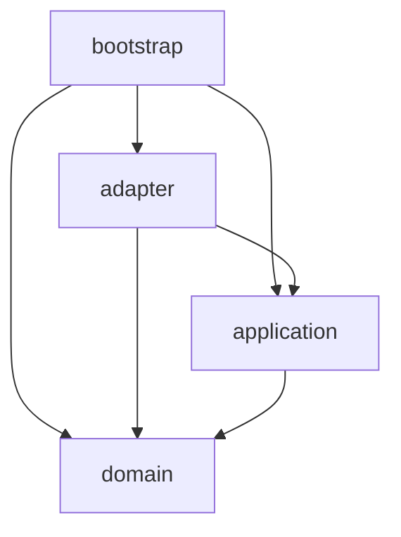

# 10. Directory Layout

> Translation: [日本語](../ja/10-directory-layout.md) ／ [Back to index](../README.md)

A package layout aligned with Clean Architecture / DDD ([01](01-architecture.md) / [02](02-domain-model.md)). Layers map to packages, and the dependency rule is expressed by directory boundaries.

## 1. Overall Layout

```
kode/
├── build.gradle.kts
├── settings.gradle.kts
├── gradle/
│   ├── libs.versions.toml            # version catalog (centralized dependency management)
│   └── wrapper/
├── gradlew / gradlew.bat
├── LICENSE                            # Apache-2.0
├── NOTICE                             # third-party license notices (ch. 09)
├── README.md
├── docs/
│   └── design/                        # this design document (ja / en)
└── src/
    ├── main/
    │   ├── kotlin/dev/kode/
    │   │   ├── domain/                # ── innermost (framework-agnostic)
    │   │   │   ├── entity/            #   KotlinProject, Diagnostic, Reference, Symbol, TestClass, FileTreeNode
    │   │   │   ├── valueobject/       #   FilePath, SourcePosition, CodeSnippet, SymbolName, Severity ...
    │   │   │   ├── service/           #   SnippetExtractor, SymbolMatcher
    │   │   │   └── port/              #   DiagnosticsPort, ReferencePort, SymbolPort, BuildModelPort,
    │   │   │                          #   TestDiscoveryPort, FileTreePort, ProjectConfigRepository
    │   │   ├── application/           # ── use cases
    │   │   │   ├── usecase/           #   AnalyzeErrors / FindReferences / FindTests / BuildTree / ListSymbols / InitProject
    │   │   │   └── dto/               #   use case I/O (presenter-agnostic)
    │   │   ├── adapter/               # ── interface adapters
    │   │   │   ├── cli/               #   Clikt commands (driving)
    │   │   │   ├── presenter/         #   JSON output (kotlinx.serialization), error envelope
    │   │   │   ├── lsp/               #   port impls via LSP4J (driven), KodeLanguageClient
    │   │   │   ├── gradle/            #   Gradle Tooling API impl + BuildAction (driven)
    │   │   │   ├── fs/                #   FileTreePort impl (driven)
    │   │   │   └── config/            #   .kode.json repository impl (driven)
    │   │   └── bootstrap/             # ── Composition Root
    │   │       └── Main.kt            #   Pure DI wiring + top-level exception handling
    │   └── resources/
    │       └── META-INF/native-image/dev.kode/   # reflect/resource/jni-config.json (ch. 08)
    └── test/
        └── kotlin/dev/kode/
            ├── domain/               # pure unit tests (fast, no external deps)
            ├── application/          # use case tests with mocked ports (MockK)
            └── adapter/              # integration tests (real LSP/Gradle separated by tags)
```

> The root package `dev.kode` is provisional. Adjust to the group ID chosen at OSS publication time.

## 2. Dependency Rule (between packages)

Enforce the rule from [01](01-architecture.md) §5 via directories:



- `domain` depends on no other package (Kotlin stdlib + basic kotlinx only).
- `adapter.*` (driven) **implements** `domain.port` and depends on the respective infra (LSP4J/TAPI/nio).
- Only `bootstrap` binds all layers together and wires them.

### Mechanical verification (recommended)
Pin the dependency rule as a test using **ArchUnit** (or konsist):

```kotlin
// pseudo-code: test/architecture
@Test fun domain_must_not_depend_on_frameworks() {
    noClasses().that().resideInAPackage("..domain..")
        .should().dependOnClassesThat()
        .resideInAnyPackage("..adapter..", "org.eclipse.lsp4j..", "org.gradle..")
        .check(importedClasses)
}
```

## 3. Module Splitting Guidance (single module for v1)

- The first version is a **single Gradle module**; start small (express boundaries via packages).
- As it grows, split into `:domain` / `:application` / `:adapter` / `:app(bootstrap)` to **enforce the dependency direction at compile time**. Migration is easy thanks to the port abstraction.

## 4. Build Artifact

- From `:kode` (application), produce a **single binary `kode`** via GraalVM Native Image ([08](08-native-image.md)).
- The config under `META-INF/native-image/` is embedded into the binary as resources.
- The Kotlin LSP is not included in the artifact ([04](04-lsp.md) / [09](09-dependencies-license.md)).
