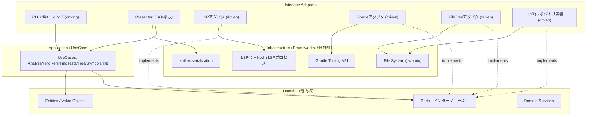

# 01. アーキテクチャ（Clean Architecture）

> 対訳: [English](../en/01-architecture.md) ／ [索引に戻る](../README.md)

## 1. 方針

`kode` は **Clean Architecture** を採用する。中心に技術非依存の **ドメイン** を置き、LSP・Gradle・ファイルシステム・JSONシリアライザといった外部技術はすべて外側に配置する。**依存の向きは常に内向き**（外→内）であり、ドメインは外部技術を一切知らない。

これにより:

- LSPやGradleの差し替え・モック化が容易（テスト可能性）。
- Kotlin LSPがAlpha／一部クローズドであっても、ドメインは影響を受けない（[04](04-lsp.md)）。
- native-image固有の制約（リフレクション回避など）を外側に閉じ込められる（[08](08-native-image.md)）。

## 2. レイヤ構成



依存方向の原則（**Dependency Rule**）: 矢印（依存）は常に外側から内側へ向かう。`implements` の点線は、外側のアダプタが内側（ドメイン）で定義された **ポート** を実装することを表す（依存性逆転＝DIP）。

## 3. 各レイヤの責務

### Domain（最内核）
- フレームワーク非依存。Kotlin標準ライブラリのみに依存。
- **エンティティ**・**値オブジェクト**・**ドメインサービス**・**ポート（インターフェース）** を持つ。
- 「意味解釈はしない・データを構造化するまで」という `kode` の責務境界をモデルで表現する。
- 詳細は [02. ドメインモデル](02-domain-model.md)。

### Application / UseCase
- 各コマンドに1つのユースケース:
  - `AnalyzeErrorsUseCase`（`kode errors`）
  - `FindReferencesUseCase`（`kode refs`）
  - `FindTestsUseCase`（`kode test`）
  - `BuildTreeUseCase`（`kode tree`）
  - `ListSymbolsUseCase`（`kode symbols`）
  - `InitProjectUseCase`（`kode init`）
- ポート越しに外部リソースを呼び出し、ドメインオブジェクトを組み立てて結果DTOを返す。

### Interface Adapters
- **Driving（駆動する側）**: Clikt の CLI コマンド。入力をパースしユースケースを呼ぶ。`Presenter` がユースケース結果をJSON文字列に変換し stdout/stderr に振り分ける（[07](07-error-handling.md)）。
- **Driven（駆動される側）**: 各ポートの実装。外部技術のレスポンスをドメインオブジェクトへマッピングする「腐敗防止層（ACL）」。

### Infrastructure / Frameworks
- LSP4J＋Kotlin LSPプロセス、Gradle Tooling API、`java.nio` ファイルシステム、kotlinx.serialization など具体技術。

## 4. コンポジションルートと Pure DI

DIフレームワーク（Koin/Springなど）は **使わない**。理由は native-image でのリフレクション/動的プロキシ回避（[08](08-native-image.md)）と、Clean Architectureの配線を明示化するため。

`bootstrap/Main.kt` を **唯一の合成点（Composition Root）** とし、ここで全ての実装を手動配線する。

```kotlin
// 擬似コード: bootstrap/Main.kt
fun main(args: Array<String>) {
    // --- Infrastructure / Adapters（外側）を生成 ---
    val configRepo: ProjectConfigRepository = JsonProjectConfigRepository(fs = NioFileSystem)
    val lspFactory: LspSessionFactory = Lsp4jSessionFactory(resolver = KotlinLspResolver())
    val gradle: BuildModelPort = GradleToolingAdapter()
    val fileTree: FileTreePort = NioFileTreeAdapter()

    // --- UseCases（内側）へポート実装を注入 ---
    val errors  = AnalyzeErrorsUseCase(configRepo, lspFactory)
    val refs    = FindReferencesUseCase(configRepo, lspFactory)
    val tests   = FindTestsUseCase(configRepo, gradle)
    val tree    = BuildTreeUseCase(configRepo, fileTree)
    val symbols = ListSymbolsUseCase(configRepo, lspFactory)
    val init    = InitProjectUseCase(gradle, configRepo)

    // --- CLI（driving adapter）を構築して実行 ---
    KodeCli(errors, refs, tests, tree, symbols, init).main(args)
}
```

ポイント: 内側（UseCase）はインターフェース（ポート）にのみ依存し、具体実装は外側でインスタンス化して注入する。

## 5. モジュール／パッケージ境界

| パッケージ | レイヤ | 依存してよい相手 |
|------------|--------|-------------------|
| `domain` | Domain | （なし。Kotlin標準のみ） |
| `application` | UseCase | `domain` |
| `adapter.cli` / `adapter.presenter` | Interface Adapter (driving) | `application`, `domain` |
| `adapter.lsp` / `.gradle` / `.fs` / `.config` | Interface Adapter (driven) | `domain`（ポート実装）, 各infra |
| `bootstrap` | Composition Root | すべて |

この依存規則は ArchUnit 等で機械的に検証することを推奨（[10](10-directory-layout.md)）。

## 6. 関連章

- ドメインの中身 → [02. ドメインモデル](02-domain-model.md)
- 各ユースケースの流れ → [03. 各コマンドの処理フロー](03-commands.md)
- ポート実装の詳細 → [04. LSP](04-lsp.md) / [05. Gradle](05-gradle-tooling.md) / [06. Config](06-config-kode-json.md)
