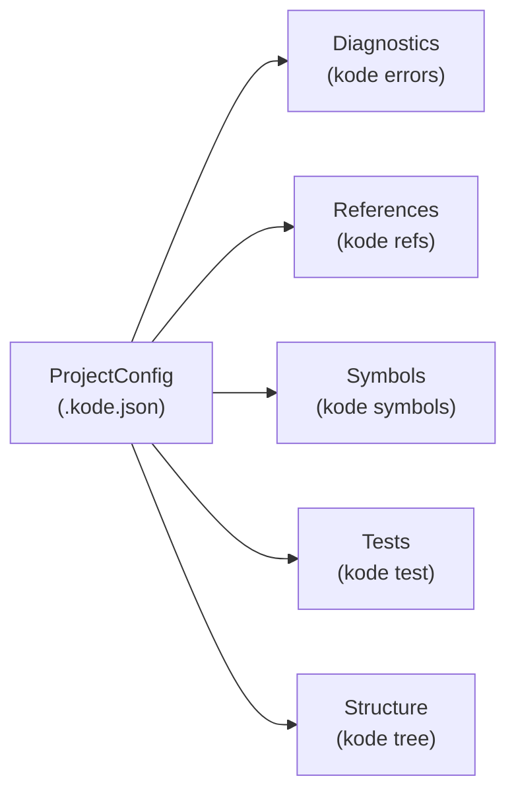

# 02. ドメインモデル（DDD）

> 対訳: [English](../en/02-domain-model.md) ／ [索引に戻る](../README.md)

## 1. ユビキタス言語

| 用語 | 意味 |
|------|------|
| Project（プロジェクト） | `.kode.json` で認識されたKotlinプロジェクト。集約ルート。 |
| Diagnostic（診断） | LSPが返すエラー/警告（位置・重大度・メッセージ・スニペット）。 |
| Reference（参照） | あるシンボルを参照しているソース上の箇所。 |
| Symbol（シンボル） | クラス・関数・プロパティなどコード上の名前付き要素。 |
| TestClass（テストクラス） | 対象に関連するテストクラスとそのテスト関数。 |
| FileTreeNode（ツリーノード） | ファイルツリーのディレクトリ/ファイル。 |

`kode` は「**収集と構造化**」までを語彙とする。「この修正が正しい」「このテストを足すべき」といった **判断の語彙は持たない**（AIの責務）。

## 2. 境界づけられたコンテキスト

各コマンドはほぼ1コンテキストに対応する。コンテキスト間の結合は弱く、共有するのは `ProjectConfig` コンテキストのみ。



## 3. 値オブジェクト（Value Object）

不変・等価性は値で判定。

```kotlin
// 擬似コード: domain/valueobject
@JvmInline value class FilePath(val value: String)      // プロジェクトルート相対
data class SourcePosition(val line: Int, val column: Int) // 1-based
@JvmInline value class CodeSnippet(val text: String)
@JvmInline value class SymbolName(val value: String)     // "FooClass" / "FooClass.doSomething"
enum class Severity { ERROR, WARNING, INFORMATION, HINT }
@JvmInline value class KotlinVersion(val value: String)  // "2.1.0"
```

不変条件（例）: `SourcePosition.line >= 1`、`FilePath` は絶対パスを保持しない（出力は常にルート相対）。

## 4. エンティティ・集約

### 集約ルート: `KotlinProject`
```kotlin
// 擬似コード: domain/entity
class KotlinProject(
    val root: ProjectRoot,            // 絶対パス（境界の内側にのみ存在）
    val buildTool: BuildTool,         // GRADLE（将来 MAVEN）
    val kotlinVersion: KotlinVersion,
    val sourceDirs: List<FilePath>,
    val testDirs: List<FilePath>,
)
```
`.kode.json` の生成・読込はこの集約を中心に行う（[06](06-config-kode-json.md)）。

### その他のエンティティ／結果オブジェクト
```kotlin
data class Diagnostic(
    val position: SourcePosition,
    val severity: Severity,
    val message: String,
    val snippet: CodeSnippet,
)
data class Reference(val file: FilePath, val position: SourcePosition, val snippet: CodeSnippet)
data class Symbol(           // documentSymbol を kode の語彙へ正規化したもの
    val kind: SymbolKind,    // CLASS / FUNCTION / PROPERTY ...
    val name: SymbolName,
    val detail: SymbolDetail // フィールド/引数/戻り値など kind 依存の詳細
)
data class TestClass(val name: SymbolName, val file: FilePath, val functions: List<SymbolName>)
sealed interface FileTreeNode {
    data class Directory(val name: String, val children: List<FileTreeNode>) : FileTreeNode
    data class File(val name: String) : FileTreeNode
}
```

## 5. ポート（Domain側インターフェース）

外部技術はすべて **ポート** の背後に隠す。ポートは **ドメイン語彙で** 入出力する（LSPやGradleの型は漏らさない）。これらの実装は Interface Adapter 層に置く（[01](01-architecture.md)）。

```kotlin
// 擬似コード: domain/port
interface DiagnosticsPort { fun diagnostics(file: FilePath): List<Diagnostic> }       // LSP実装
interface ReferencePort  { fun references(target: SymbolName): List<Reference> }       // LSP実装
interface SymbolPort     { fun symbols(file: FilePath): List<Symbol> }                 // LSP実装
interface TestDiscoveryPort { fun testsFor(target: SymbolName): List<TestClass> }      // Gradle実装
interface BuildModelPort { fun introspect(root: ProjectRoot): KotlinProject }          // Gradle実装
interface FileTreePort   { fun walk(roots: List<FilePath>): FileTreeNode.Directory }   // FS実装
interface ProjectConfigRepository {                                                    // .kode.json実装
    fun load(start: ProjectRoot): KotlinProject?
    fun save(project: KotlinProject)
}
```

| ポート | 実装レイヤ | 章 |
|--------|-----------|----|
| `DiagnosticsPort` / `ReferencePort` / `SymbolPort` | `adapter.lsp` | [04](04-lsp.md) |
| `TestDiscoveryPort` / `BuildModelPort` | `adapter.gradle` | [05](05-gradle-tooling.md) |
| `FileTreePort` | `adapter.fs` | — |
| `ProjectConfigRepository` | `adapter.config` | [06](06-config-kode-json.md) |

## 6. ドメインサービス

エンティティ単体に属さないロジックはドメインサービスへ。例:

- `SnippetExtractor`: 位置情報からソース行の周辺スニペットを切り出す純粋ロジック（I/Oはポート経由でテキストを受け取る）。
- `SymbolMatcher`: `SymbolName`（`Foo` / `Foo.bar`）の解釈と、テスト・参照対象の同定ルール。

これらは副作用を持たず、単体テストが容易（[10](10-directory-layout.md)）。

## 7. 不変性とエラー表現

- ドメインは例外を投げ得るが、**プロセス境界では必ずJSONに変換** する（[07](07-error-handling.md)）。
- 「結果が空」（参照0件・診断0件など）は **正常系**。空配列を返し、エラーにはしない。
