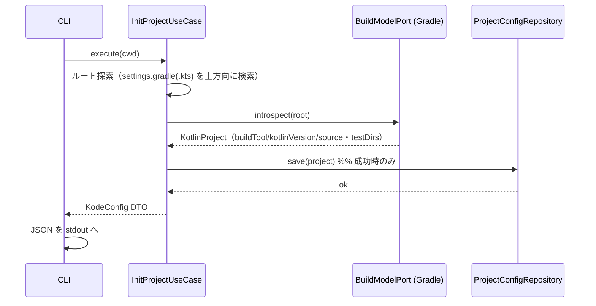
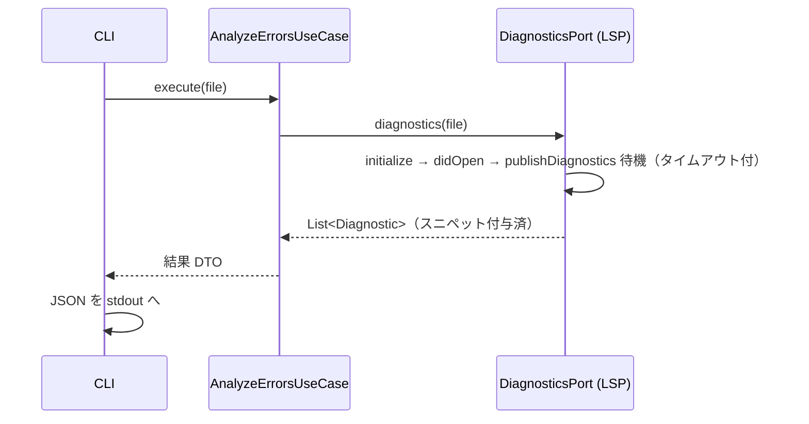
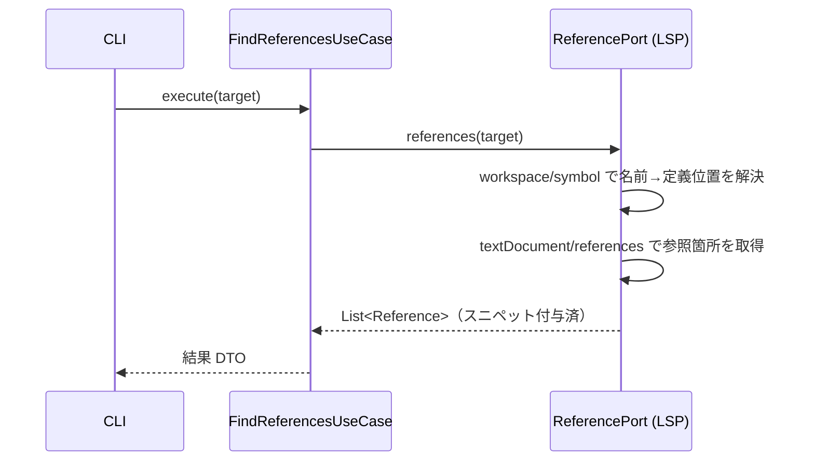
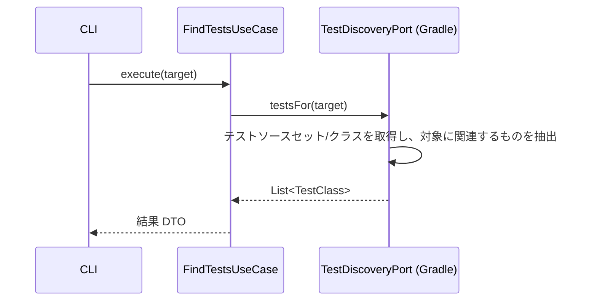
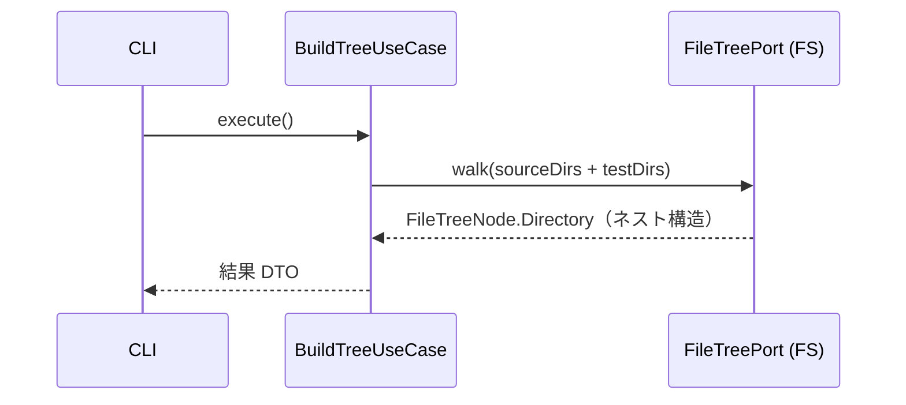
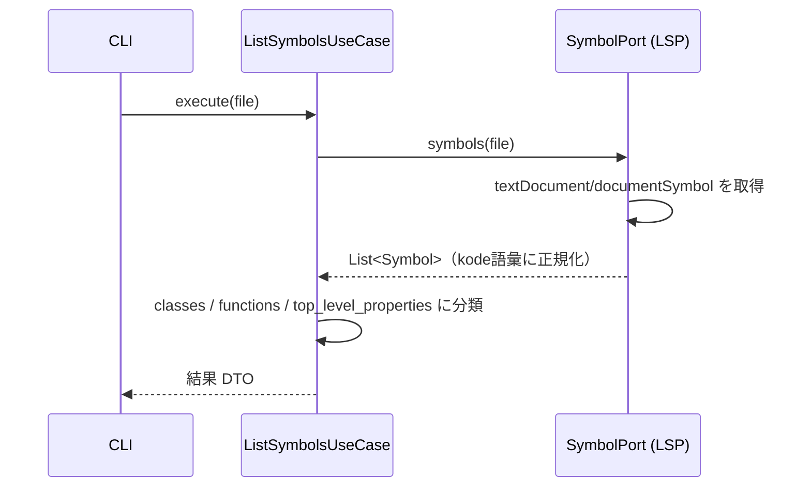

# 03. 各コマンドの処理フロー

> 対訳: [English](../en/03-commands.md) ／ [索引に戻る](../README.md)

各コマンドは「Cliktコマンド（driving adapter）→ UseCase → ポート → Presenter（JSON）」という共通構造を持つ（[01](01-architecture.md)）。出力JSONスキーマは要件定義のサンプルに準拠する。

共通の前処理: `init` 以外のコマンドは、まず `ProjectConfigRepository.load()` で `.kode.json` を解決する。見つからなければ exit code 2 のエラーJSONを返す（[07](07-error-handling.md)）。

---

## `kode init`

プロジェクトを認識し `.kode.json` を生成する。**エラー時は何も生成しない。**



```kotlin
// 擬似コード
fun InitProjectUseCase.execute(cwd: ProjectRoot): KodeConfig {
    val root = findProjectRoot(cwd) ?: throw NoProjectRootException()
    val project = gradle.introspect(root)   // 失敗時は例外 → ここで中断（保存しない）
    configRepo.save(project)                // 成功時のみ書き込み（atomic, 06章）
    return project.toConfigDto()
}
```

出力:
```json
{
  "version": "1.0",
  "project": {
    "root": "/path/to/project",
    "build_tool": "gradle",
    "kotlin_version": "2.1.0",
    "source_dirs": ["src/main/kotlin"],
    "test_dirs": ["src/test/kotlin"]
  }
}
```

---

## `kode errors <file>`

エラー・警告と周辺スニペットをLSP経由で返却。診断は **プッシュ型通知** のため `didOpen` 後に待機する（[04](04-lsp.md)）。



出力:
```json
{
  "file": "src/main/kotlin/Foo.kt",
  "diagnostics": [
    {
      "line": 42,
      "column": 10,
      "severity": "error",
      "message": "Type mismatch: expected String, found Int",
      "snippet": "val x: String = 42"
    }
  ]
}
```

---

## `kode refs <class/function>`

指定クラス・関数の参照元一覧をLSP経由で返却。LSPの `references` は **位置** を要求するため、名前は `workspace/symbol` で位置解決してから参照を取得する2段構え（[04](04-lsp.md)）。



出力:
```json
{
  "target": "FooClass",
  "refs": [
    { "file": "src/main/kotlin/Bar.kt", "line": 10, "column": 5, "snippet": "val foo = FooClass()" }
  ]
}
```

---

## `kode test <class/function>`

関連テストクラス・関数一覧をGradle Tooling API経由で返却（[05](05-gradle-tooling.md)）。



出力:
```json
{
  "target": "FooClass",
  "tests": [
    {
      "class": "FooClassTest",
      "file": "src/test/kotlin/FooClassTest.kt",
      "functions": ["testSomething", "testAnotherThing"]
    }
  ]
}
```

---

## `kode tree`

プロジェクト全体のファイルツリーを返却。`.kode.json` の `source_dirs` / `test_dirs` を基点にFS走査する。



出力:
```json
{
  "tree": {
    "src/main/kotlin/com/example": {
      "type": "directory",
      "children": [
        {"type": "file", "name": "Foo.kt"},
        {"type": "file", "name": "Bar.kt"},
        {"type": "directory", "name": "service", "children": [
          {"type": "file", "name": "FooService.kt"}
        ]}
      ]
    }
  }
}
```

---

## `kode symbols <file>`

ファイル内のクラス・関数・プロパティ一覧をLSP経由で返却（`textDocument/documentSymbol`）。



出力:
```json
{
  "file": "src/main/kotlin/Foo.kt",
  "classes": [
    { "name": "FooClass", "fields": [ {"name": "bar", "type": "String", "mutable": false} ] }
  ],
  "functions": [
    {
      "name": "doSomething",
      "arguments": [ {"name": "input", "type": "String"}, {"name": "count", "type": "Int"} ],
      "return_type": "Boolean"
    }
  ],
  "top_level_properties": [ {"name": "CONSTANT", "type": "String", "mutable": false} ]
}
```

---

## `kode doctor`

環境をチェックし、準備状況をJSONで報告する: `.kode.json` の有効性、Kotlin LSP の解決（どの優先順位ステップで解決したかも報告、[04](04-lsp.md)）、Javaランタイム（スタンドアロンLSPランチャーは JRE 17+ が必要）。チェックは読み取り専用。`--install-lsp` を付けると、LSPが未解決の場合のみ pinned バージョンを `~/.kode/lsp/` にダウンロードする。チェック失敗でも exit 0（状態はJSON内）。ダウンロード失敗のみエラーとなる（`LSP_DOWNLOAD_FAILED`、exit 3）。

出力:
```json
{
  "ok": true,
  "checks": [
    { "name": "project_config", "status": "ok", "detail": ".kode.json found (project root: /path/to/project)" },
    { "name": "lsp_binary", "status": "ok", "detail": "kotlin-lsp resolved via managed: /home/user/.kode/lsp/262.8190.0/kotlin-lsp.sh" },
    { "name": "java_runtime", "status": "ok", "detail": "Java 21 found" }
  ],
  "lsp": { "source": "managed", "path": "/home/user/.kode/lsp/262.8190.0/kotlin-lsp.sh", "installed_version": "262.8190.0" }
}
```

失敗したチェックには対処方法を示す `hint` が付く（例: `Run 'kode init' at the project root.`）。

---

## `kode mcp`

kode を **stdio 上の MCP (Model Context Protocol) サーバー** として起動し、読み取り専用の解析コマンドをツールとして公開する: `kode_tree`, `kode_errors`, `kode_symbols`, `kode_refs`, `kode_test`。CLI と並ぶ第二の駆動アダプターであり、各ツールは同じユースケースを呼び、同じ JSON プレゼンターで描画するため、ツールのテキスト内容は CLI の stdout とバイト単位で一致する。

プロトコル上の注意:
- 改行区切りの JSON-RPC 2.0(MCP stdio トランスポート。`Content-Length` フレーミングなし)。kotlinx.serialization による自前実装で、MCP SDK 依存なし・native-image 設定ゼロ([09](09-dependencies-license.md))。
- `initialize`(プロトコルバージョン `2025-06-18` / `2025-03-26`)、`ping`、`tools/list`、`tools/call` を処理。その他の通知は無視、その他のリクエストは `-32601`。
- ツール実行の失敗(あらゆる `KodeException`)は標準エラーエンベロープ([07](07-error-handling.md))を載せた `isError: true` のツール**結果**として返す — プロトコルエラーにはしない(AIが読めるように)。引数の欠落・不明ツールは `-32602`。
- プロジェクトルートはサーバープロセスの作業ディレクトリ(CLIと同じ)— プロジェクトごとにサーバーを登録すること。

```bash
claude mcp add kode -- kode mcp   # Claude Code への登録(プロジェクトルートで実行)
```
