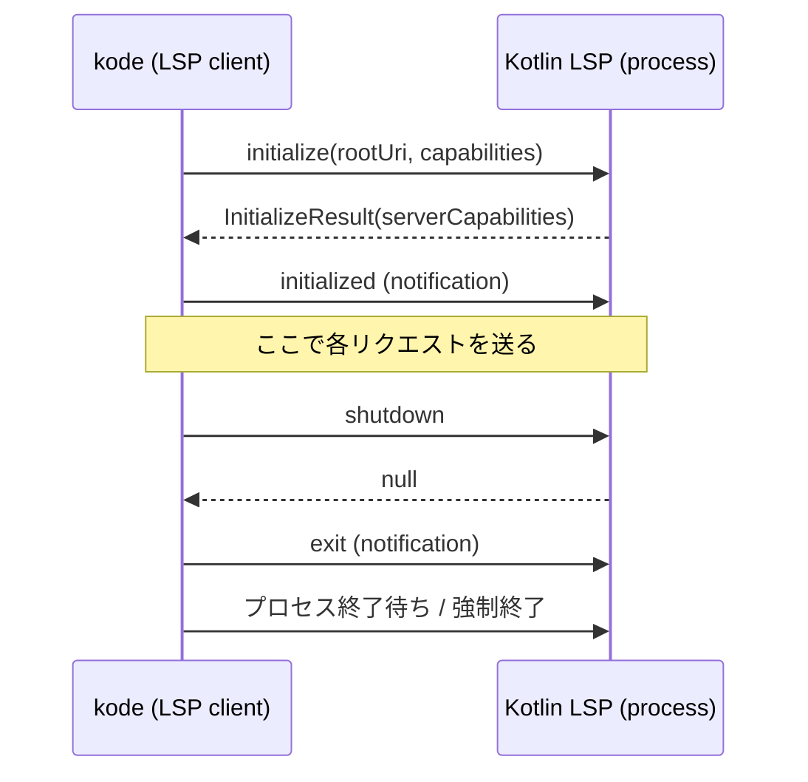

# 04. LSP接続・通信方式

> 対訳: [English](../en/04-lsp.md) ／ [索引に戻る](../README.md)

`kode errors` / `kode refs` / `kode symbols` は **JetBrains公式 Kotlin Language Server** を介してコード解析を行う。本章はその接続・通信方式と、OSS公開上の重要方針を述べる。

## 1. OSS上の重要方針: Kotlin LSP は同梱しない

JetBrains Kotlin LSP（`Kotlin/kotlin-lsp`）は **Apache-2.0 だが、IntelliJ IDEA / Fleet / Air の独自部分に基づき一部クローズドソース** であり、かつ **Alpha** ステージである（[09](09-dependencies-license.md)）。

したがって `kode` は LSPバイナリを **同梱・再配布しない**。ユーザーが別途インストールしたものを **外部プロセスとして起動** する。

### バイナリ解決順序
1. 環境変数 `KODE_LSP_PATH`
2. `.kode.json` の任意フィールド（例 `lsp.path`）
3. `PATH` 上の `kotlin-lsp`（Homebrew等で導入: `brew install JetBrains/utils/kotlin-lsp`）

未検出時は機械可読なエラーJSONを返し、導入方法を `details` に含める（[07](07-error-handling.md)）。

```json
{ "error": { "code": "LSP_NOT_FOUND",
  "message": "Kotlin LSP binary not found",
  "details": "Set KODE_LSP_PATH or install via 'brew install JetBrains/utils/kotlin-lsp'" } }
```

## 2. トランスポート

子プロセスの **stdin/stdout** に対して **LSP基本プロトコル**（`Content-Length` ヘッダ付き JSON-RPC 2.0）で通信する。実装は **Eclipse LSP4J** の `LSPLauncher` を用い、フレーミング・JSON-RPCの詳細を委譲する（自前実装しない）。

```kotlin
// 擬似コード: adapter/lsp/Lsp4jSessionFactory.kt
fun connect(root: ProjectRoot): LspSession {
    val process = ProcessBuilder(resolveLspBinary(), "--stdio")
        .directory(root.toFile())
        .redirectError(ProcessBuilder.Redirect.DISCARD) // LSPのログをstdoutへ混ぜない
        .start()
    val client = KodeLanguageClient()  // publishDiagnostics 等の通知受信
    val launcher = LSPLauncher.createClientLauncher(client, process.inputStream, process.outputStream)
    val server = launcher.remoteProxy   // org.eclipse.lsp4j.services.LanguageServer
    launcher.startListening()
    return LspSession(process, server, client)
}
```

> 注意: LSPの診断・ログは厳密に LSP プロトコル経由で受け取り、`kode` 自身の **stdout はJSON結果専用** に保つ（[07](07-error-handling.md)）。子プロセスのstderrは破棄またはkodeのstderrへ。

## 3. ライフサイクル



- 初版は **1コマンド = 1短命セッション**（起動→処理→終了）。実装が単純で状態管理が不要。
- **トレードオフ（将来案）**: 起動コストが大きい場合は常駐デーモン化を検討（別プロセスでLSPを保持し、kodeはIPCで問い合わせる）。初版スコープ外。

## 4. 各コマンドのLSP呼び出し詳細

### `kode errors`: 診断はプッシュ型
LSPの診断は要求/応答ではなく **`textDocument/publishDiagnostics` 通知** で非同期に届く。よって:

1. `textDocument/didOpen` で対象ファイルを開く。
2. `KodeLanguageClient.publishDiagnostics` で通知を受ける。
3. **タイムアウト付き** で「対象ファイルの診断が安定するまで」待つ（例: 通知到達後さらに静定時間を待つ、または上限N秒）。

```kotlin
// 擬似コード
fun diagnostics(file: FilePath): List<Diagnostic> = session.use { s ->
    val future = client.awaitDiagnostics(uriOf(file), timeout = 10.seconds)
    s.server.textDocumentService.didOpen(didOpenParams(file))
    future.get().map { it.toDomain(snippet = snippetExtractor.around(file, it.range)) }
}
```

### `kode refs`: 位置解決の2段構え
`textDocument/references` は **位置（行・列）** を要求するが、`kode refs` の入力は **名前**。そこで:

1. `workspace/symbol("FooClass")` で候補シンボルとその定義位置を取得。
2. 最も妥当な定義位置に対し `textDocument/references(includeDeclaration=false)` を実行。
3. 各参照箇所にスニペットを付与してドメインへマッピング。

`Foo.bar` のようにメンバ指定された場合は `SymbolMatcher`（[02](02-domain-model.md)）で絞り込む。

### `kode symbols`: documentSymbol の正規化
`textDocument/documentSymbol` の階層（`DocumentSymbol[]`）を走査し、`classes` / `functions` / `top_level_properties` という `kode` の語彙へ正規化する。LSPの `SymbolKind` → `kode` の `SymbolKind` 変換はアダプタ層に閉じる。

## 5. 能力ネゴシエーションと前提

`initialize` で最低限以下のクライアント能力を宣言する:

- `textDocument.publishDiagnostics`
- `textDocument.references`
- `textDocument.documentSymbol`（`hierarchicalDocumentSymbolSupport`）
- `workspace.symbol`

サーバが特定能力を持たない場合は、その機能を要するコマンドで `LSP_CAPABILITY_UNSUPPORTED` エラーを返す（[07](07-error-handling.md)）。

## 6. native-image との関係

LSP4J はリフレクションを用いる箇所があるため、native-imageでは reflection-config が必要になり得る。`native-image-agent` で設定を生成し同梱する（[08](08-native-image.md)）。LSP本体は外部プロセスのため、native-imageの制約は `kode` 側のLSP**クライアント**にのみ及ぶ。
