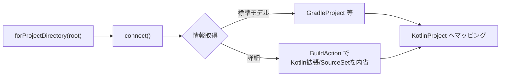
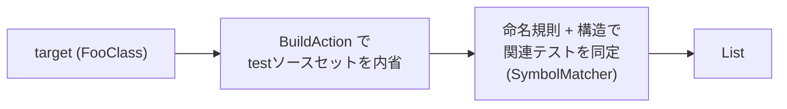

# 05. Gradle Tooling API の使い方

> 対訳: [English](../en/05-gradle-tooling.md) ／ [索引に戻る](../README.md)

`kode init`（プロジェクト認識）と `kode test`（関連テスト探索）は **Gradle Tooling API** を用いる。Tooling API は `kode` バイナリに内包し、Apache-2.0 でOSS公開上の問題はない（[09](09-dependencies-license.md)）。

## 1. 接続の基本

```kotlin
// 擬似コード: adapter/gradle/GradleToolingAdapter.kt
fun <T> withConnection(root: ProjectRoot, block: (ProjectConnection) -> T): T {
    val connector = GradleConnector.newConnector()
        .forProjectDirectory(root.toFile())
        // Wrapper を優先（gradle/wrapper/gradle-wrapper.properties のバージョンを使用）
    val connection = connector.connect()
    return connection.use(block)   // ProjectConnection は AutoCloseable
}
```

- **Wrapper優先**: プロジェクトの `gradlew` バージョンに追従し、互換性を担保する。Wrapperが無い場合のみ `useGradleVersion` 等のフォールバックを検討。
- **Daemon**: Tooling API は Gradle Daemon を起動する。初回は起動コストが高い点をエラー方針のタイムアウトに織り込む（[07](07-error-handling.md)）。

## 2. `kode init`: プロジェクトモデルの取得

ビルドツール・Kotlinバージョン・source/testディレクトリを取得する。基本情報は Tooling API 標準の `GradleProject` / `EclipseProject` 系モデルや、より詳細な情報のための **カスタム `BuildAction`** で取得する。



```kotlin
// 擬似コード
fun introspect(root: ProjectRoot): KotlinProject = withConnection(root) { c ->
    val model = c.action(KodeIntrospectionAction()).run()  // カスタム BuildAction
    KotlinProject(
        root = root,
        buildTool = BuildTool.GRADLE,
        kotlinVersion = KotlinVersion(model.kotlinVersion),
        sourceDirs = model.mainSourceDirs.map(::FilePath),
        testDirs = model.testSourceDirs.map(::FilePath),
    )
}
```

- `KodeIntrospectionAction` は `BuildAction<KodeModel>` 実装。ビルド内部の `Project`/`KotlinProjectExtension`/`SourceSet` から Kotlin バージョンとソースディレクトリを抽出する。
- Kotlinバージョンが取得できない場合は、依存解決やプラグイン情報からの推定にフォールバックし、それも不能なら `init` を **失敗** させる（部分生成はしない、[03](03-commands.md)）。

## 3. `kode test`: 関連テストの特定

`kode` は **テストを実行しない**（カバレッジ取得はスコープ外）。テストソースセットを内省し、対象シンボルに関連するテストクラス・関数を **静的に** 抽出する。



関連付けのヒューリスティクス（ドメインサービス `SymbolMatcher`、[02](02-domain-model.md)）:

- 命名規則: `FooClass` ↔ `FooClassTest` / `FooClassTests` / `FooClassSpec`。
- 同一パッケージ／対応するテストディレクトリ配下。
- テスト関数一覧は、テストソース内のクラス構造（テストアノテーション付き関数）から抽出。

> 注: より正確な参照ベースの関連付けが必要な場合は、LSPの `refs`（[04](04-lsp.md)）と組み合わせる拡張余地があるが、初版は命名・構造ベースとする。

## 4. リソース管理とエラー

- `ProjectConnection` は必ず `use { }`（try-with-resources相当）でクローズする。
- `BuildException` / 接続失敗 / タイムアウトは アダプタ層で捕捉し、`GRADLE_FAILURE`（exit 4）のドメイン例外へ変換する（[07](07-error-handling.md)）。
- Gradleの標準出力・ログは `kode` のstdoutに混ぜない（`setStandardOutput`/`setStandardError` をstderr側へ振り向ける）。

## 5. native-image との相性

Gradle Tooling API は内部でクラスローディング・Daemonプロセス起動を行うため、native-image との相性に注意が必要（[08](08-native-image.md)）。

- 必要な reflection/resource 設定を `native-image-agent` で生成・同梱する。
- どうしても native-image 上で安定しない場合の **フォールバック**: Tooling API の代わりに外部 `./gradlew` をサブプロセス起動し、`--init-script` で注入したタスクから結果（モデルJSON）を取得する方式を退避策として設計に残す。
