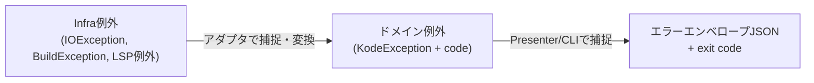

# 07. エラーハンドリング方針

> 対訳: [English](../en/07-error-handling.md) ／ [索引に戻る](../README.md)

`kode` の利用者はAIエージェントである。したがってエラーも **機械可読** でなければならない。成功も失敗も一貫した規約で扱う。

## 1. 出力規約

| 結果 | 出力先 | 形式 | exit code |
|------|--------|------|-----------|
| 成功 | **stdout** | 各コマンドのスキーマJSON（[03](03-commands.md)） | 0 |
| 失敗 | **stderr** | エラーエンベロープJSON | 非0 |

- **stdout はJSON結果専用**。ログ・進捗・LSP/Gradleの出力は決して混ぜない（混入するとAI側のJSONパースが壊れる）。診断ログは stderr へ。
- 失敗時、stdout には何も出さない（または空）。AIは exit code と stderr のJSONで判定する。

### エラーエンベロープ
```json
{
  "error": {
    "code": "LSP_NOT_FOUND",
    "message": "Kotlin LSP binary not found",
    "details": "Set KODE_LSP_PATH or install via 'brew install JetBrains/utils/kotlin-lsp'"
  }
}
```

- `code`: 安定した機械可読の識別子（下表）。AIはこれで分岐できる。
- `message`: 人間/AI向けの短い説明。
- `details`: 任意。復旧手順・原因の補足。

## 2. exit code とエラーコード体系

| exit | 区分 | 代表 `code` | 意味 |
|------|------|-------------|------|
| 0 | 成功 | — | 正常（結果0件も成功） |
| 1 | 一般エラー | `INTERNAL_ERROR`, `INVALID_ARGUMENT` | 想定外・引数不正 |
| 2 | 設定なし/不正 | `NO_PROJECT_CONFIG`, `INVALID_CONFIG`, `NO_PROJECT_ROOT` | `.kode.json` 未生成/破損、ルート未検出 |
| 3 | LSP失敗 | `LSP_NOT_FOUND`, `LSP_TIMEOUT`, `LSP_CAPABILITY_UNSUPPORTED`, `LSP_CRASHED` | LSP関連（[04](04-lsp.md)） |
| 4 | Gradle失敗 | `GRADLE_FAILURE`, `GRADLE_TIMEOUT` | Tooling API関連（[05](05-gradle-tooling.md)） |

> exit codeはカテゴリ、`code`は詳細という2層。AIは粗い分岐をexit codeで、細かい対応を`code`で行える。

## 3. 「空」は成功、エラーではない

参照0件・診断0件・テスト0件は **正常系**。`refs: []` のように空配列で返し exit 0 とする。「見つからなかった」とエラーにしない（[02](02-domain-model.md) §7）。

## 4. `kode init` の特則

`init` は失敗時に **`.kode.json` を一切生成しない**。`introspect`（Gradle）段階での失敗は `save` 前に中断し、ファイルシステムを変更しない（[06](06-config-kode-json.md)）。これにより「中途半端な設定が残る」ことを防ぐ。

## 5. タイムアウトと外部プロセス異常

- **LSP**: `didOpen` 後の診断待ち、`references`/`documentSymbol` 応答に上限時間を設ける → `LSP_TIMEOUT`。プロセスがクラッシュ/異常終了したら `LSP_CRASHED`。いずれもプロセスを確実に終了（kill）してからエラーを返す。
- **Gradle**: Daemon起動を含むため十分なタイムアウトを設定 → `GRADLE_TIMEOUT`。`BuildException` は `GRADLE_FAILURE`。
- いずれも子プロセスのリーク防止のため、`finally` で `destroy()` / `connection.close()` を保証する。

## 6. Clean Architecture 上の例外変換

例外はレイヤごとに役割を分ける（[01](01-architecture.md)）。



- **アダプタ層**: 外部技術の例外を、安定した `code` を持つ `KodeException` のサブタイプへ変換（腐敗防止）。
- **CLI/Presenter層**: トップレベルで `KodeException` を捕捉し、エンベロープJSONをstderrへ、対応するexit codeで終了。未捕捉の例外は `INTERNAL_ERROR`（exit 1）に丸める（スタックトレースはstderrのdetailsに要約のみ、機微情報を出さない）。

```kotlin
// 擬似コード: bootstrap でのトップレベルハンドリング
fun runCli(args: Array<String>): Int = try {
    KodeCli(...).parse(args)   // 成功時 stdout に結果JSON
    0
} catch (e: KodeException) {
    System.err.println(json.encodeToString(e.toEnvelope()))
    e.exitCode
} catch (e: Throwable) {
    System.err.println(json.encodeToString(internalErrorEnvelope(e)))
    1
}
```

## 7. ログ方針

- 既定では `kode` 自身のログは出さない（AI向けにノイズを避ける）。
- `--verbose` 等を付けた場合のみ **stderr** に診断ログを出す。stdoutのJSON契約は常に不変。
