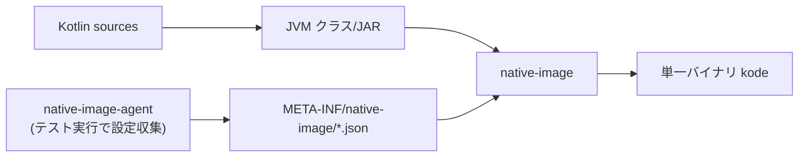

# 08. GraalVM Native Image ビルド方針

> 対訳: [English](../en/08-native-image.md) ／ [索引に戻る](../README.md)

`kode` は **単一バイナリ** として配布する。AIエージェントが起動コストを意識せず多数回呼び出せること、JVM不要で導入が容易なことが目的。

## 1. toolchain とライセンス（OSS重要）

- ビルドには **GraalVM CE（GPLv2 + Classpath Exception）** を用いる。
- Gradleプラグインは **`org.graalvm.buildtools.native`（Apache-2.0）**。
- **重要**: Native Image が生成した **出力バイナリはコピーレフトが伝播しない**（GraalVMのライセンスは、native-image出力を「未改変のProgram」とみなす扱い）。したがって **`kode` 本体のライセンスは Apache-2.0 を維持できる**（[09](09-dependencies-license.md)）。

## 2. ビルド構成

```kotlin
// 擬似コード: build.gradle.kts
plugins {
    kotlin("jvm")
    kotlin("plugin.serialization")
    id("org.graalvm.buildtools.native")
    application
}
graalvmNative {
    binaries {
        named("main") {
            imageName.set("kode")
            mainClass.set("dev.kode.bootstrap.MainKt")
            buildArgs.add("--no-fallback")          // フォールバックJVMを作らない
            buildArgs.add("-O2")
        }
    }
}
```



## 3. リフレクション・リソース設定

| 依存 | native-image対応 |
|------|------------------|
| kotlinx.serialization | コンパイル時生成 → **リフレクション不要**（最も相性が良い） |
| Clikt | 基本リフレクションフリー。必要に応じ最小設定 |
| LSP4J | JSON-RPCのバインディングでリフレクション使用箇所あり → **要設定** |
| Gradle Tooling API | 動的クラスロード・Daemon起動 → **要注意**（§5） |

設定生成方針:

1. テスト（または代表的な実行）を **`native-image-agent`** 付きで走らせ、`reflect-config.json` / `resource-config.json` / `jni-config.json` / `proxy-config.json` を収集。
2. 生成物を `src/main/resources/META-INF/native-image/dev.kode/` に配置し、ビルドに取り込む。
3. CIで「エージェント実行 → 設定更新差分チェック」を行い、設定の陳腐化を検出。

## 4. リスクと対策

| リスク | 対策 |
|--------|------|
| LSP4J のリフレクション漏れで実行時エラー | エージェントのカバレッジを各LSP機能（errors/refs/symbols）で網羅。手動 reflect-config 追記の余地を残す |
| Gradle Tooling API が native 上で不安定 | §5 のフォールバック（外部 `gradlew` 起動）を設計に保持 |
| 子プロセス起動（LSP/Gradle）が native で問題化 | `ProcessBuilder` は native-image でサポートされるが、`java.home` 非依存に実装。パスは明示解決（[04](04-lsp.md) §1） |
| ビルド時間・バイナリサイズ | `-O2`／不要依存の除去。CIでOS別にキャッシュ |

## 5. Gradle Tooling API のフォールバック方針

native-image 上で Tooling API が安定しない場合に備え、`BuildModelPort` / `TestDiscoveryPort` の実装を **2系統** 用意できる設計にする（[01](01-architecture.md) のポート抽象を活用）:

1. **本命**: Tooling API をプロセス内で利用。
2. **退避**: 外部 `./gradlew` をサブプロセス起動し、`--init-script` で注入したタスクが内省結果（JSON）を標準出力に書き出し、それをパースする。

ポートで抽象化しているため、切替はコンポジションルート（[01](01-architecture.md) §4）の配線変更のみで済む。

## 6. 配布

- CIで **OS/アーキ別**（linux-x64 / linux-arm64 / macos-arm64 / windows-x64 など）にクロスビルドし、リリースに添付。
- Kotlin LSP は **同梱しない**（[04](04-lsp.md)）。インストール手順をREADMEとエラーメッセージ（`LSP_NOT_FOUND` の `details`）で案内。
- 配布物のライセンス表記（NOTICE / THIRD-PARTY）は [09](09-dependencies-license.md) を参照。
