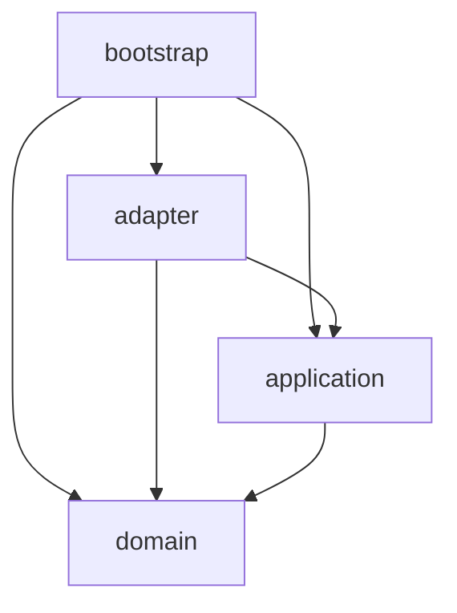

# 10. ディレクトリ構成案

> 対訳: [English](../en/10-directory-layout.md) ／ [索引に戻る](../README.md)

Clean Architecture / DDD（[01](01-architecture.md) / [02](02-domain-model.md)）に沿ったパッケージ構成。レイヤ＝パッケージで対応させ、依存規則をディレクトリ境界で表現する。

## 1. 全体構成

```
kode/
├── build.gradle.kts
├── settings.gradle.kts
├── gradle/
│   ├── libs.versions.toml            # バージョンカタログ（依存の一元管理）
│   └── wrapper/
├── gradlew / gradlew.bat
├── LICENSE                            # Apache-2.0
├── NOTICE                             # 第三者ライセンス表記（09章）
├── README.md
├── docs/
│   └── design/                        # 本設計書（ja / en）
└── src/
    ├── main/
    │   ├── kotlin/dev/kode/
    │   │   ├── domain/                # ── 最内核（フレームワーク非依存）
    │   │   │   ├── entity/            #   KotlinProject, Diagnostic, Reference, Symbol, TestClass, FileTreeNode
    │   │   │   ├── valueobject/       #   FilePath, SourcePosition, CodeSnippet, SymbolName, Severity ...
    │   │   │   ├── service/           #   SnippetExtractor, SymbolMatcher
    │   │   │   └── port/              #   DiagnosticsPort, ReferencePort, SymbolPort, BuildModelPort,
    │   │   │                          #   TestDiscoveryPort, FileTreePort, ProjectConfigRepository
    │   │   ├── application/           # ── ユースケース
    │   │   │   ├── usecase/           #   AnalyzeErrors / FindReferences / FindTests / BuildTree / ListSymbols / InitProject
    │   │   │   └── dto/               #   ユースケース入出力（プレゼンタ非依存）
    │   │   ├── adapter/               # ── インターフェースアダプタ
    │   │   │   ├── cli/               #   Clikt コマンド（driving）
    │   │   │   ├── presenter/         #   JSON 出力（kotlinx.serialization）, エラーエンベロープ
    │   │   │   ├── lsp/               #   LSP4J による各ポート実装（driven）, KodeLanguageClient
    │   │   │   ├── gradle/            #   Gradle Tooling API 実装 + BuildAction（driven）
    │   │   │   ├── fs/                #   FileTreePort 実装（driven）
    │   │   │   └── config/            #   .kode.json リポジトリ実装（driven）
    │   │   └── bootstrap/             # ── 合成点（Composition Root）
    │   │       └── Main.kt            #   Pure DI 配線 + トップレベル例外ハンドリング
    │   └── resources/
    │       └── META-INF/native-image/dev.kode/   # reflect/resource/jni-config.json（08章）
    └── test/
        └── kotlin/dev/kode/
            ├── domain/               # 純粋単体（高速・外部依存なし）
            ├── application/          # ポートをモック（MockK）したユースケーステスト
            └── adapter/              # 結合テスト（実LSP/実Gradleはタグで分離）
```

> ルートパッケージ `dev.kode` は仮。OSS公開時のグループID確定に合わせて調整する。

## 2. 依存規則（パッケージ間）

[01](01-architecture.md) §5 の規則をディレクトリで強制する:



- `domain` は他のどのパッケージにも依存しない（Kotlin標準＋kotlinx基本のみ）。
- `adapter.*`（driven）は `domain.port` を **実装** し、各infra（LSP4J/TAPI/nio）に依存する。
- `bootstrap` のみが全レイヤを束ねて配線する。

### 機械的検証（推奨）
**ArchUnit**（または konsist）でテストとして依存規則を固定化:

```kotlin
// 擬似コード: test/architecture
@Test fun domain_must_not_depend_on_frameworks() {
    noClasses().that().resideInAPackage("..domain..")
        .should().dependOnClassesThat()
        .resideInAnyPackage("..adapter..", "org.eclipse.lsp4j..", "org.gradle..")
        .check(importedClasses)
}
```

## 3. モジュール分割の指針（初版はシングルモジュール）

- 初版は **単一Gradleモジュール** で start small（パッケージで境界を表現）。
- 規模拡大時は `:domain` / `:application` / `:adapter` / `:app(bootstrap)` のマルチモジュール化で **コンパイル時に依存方向を強制** できる。ポート抽象があるため移行は容易。

## 4. ビルド成果物

- `:kode`（application）から GraalVM Native Image で **単一バイナリ `kode`** を生成（[08](08-native-image.md)）。
- `META-INF/native-image/` の設定はリソースとしてバイナリに取り込まれる。
- Kotlin LSP は成果物に含めない（[04](04-lsp.md) / [09](09-dependencies-license.md)）。
